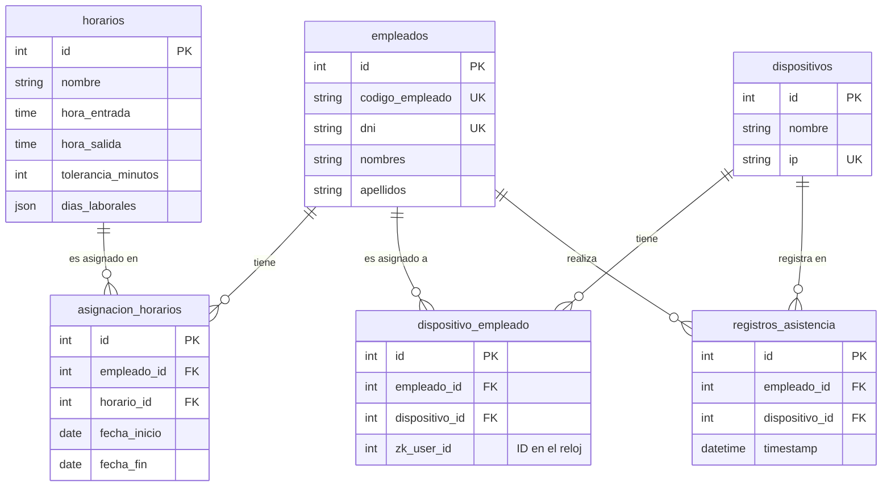

# 4. Esquema de la Base de Datos

El corazón de GobeBio reside en su estructura de base de datos relacional. Entender cómo se conectan las tablas principales es clave para desarrollar nuevas funcionalidades o depurar problemas.

## 4.1. Diagrama de Entidad-Relación (Mermaid)

El siguiente diagrama muestra las relaciones entre las tablas más importantes del sistema.

## 4.2. Descripción de Tablas Clave

### `empleados`
Almacena la información personal y laboral de cada funcionario.
- **`codigo_empleado` / `dni`**: Son campos únicos y cruciales para la lógica de "auto-corrección" en la sincronización de asistencias.

### `dispositivos`
Contiene los detalles de cada reloj biométrico, principalmente su IP para la conexión.

### `horarios`
Funciona como una plantilla para los diferentes turnos de trabajo. Define las horas de entrada/salida, la tolerancia y los días laborables.

### `asignacion_horarios`
Tabla pivot que vincula a un `empleado` con un `horario` para un rango de fechas específico (`fecha_inicio` y `fecha_fin`). Permite que un empleado cambie de horario a lo largo del tiempo.

### `dispositivo_empleado`
La tabla más importante para la sincronización. Mapea un `empleado` de Laravel con un `dispositivo` físico y, fundamentalmente, almacena el `zk_user_id`, que es el ID interno que el reloj le asigna a ese usuario.

### `registros_asistencia`
Almacena los datos crudos de las marcaciones descargadas desde los dispositivos. Cada fila es una marcación individual con su fecha y hora exactas. Esta tabla es la fuente de datos para todos los reportes.
