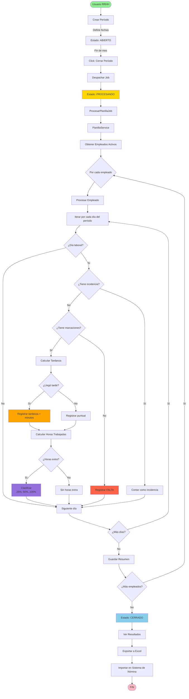
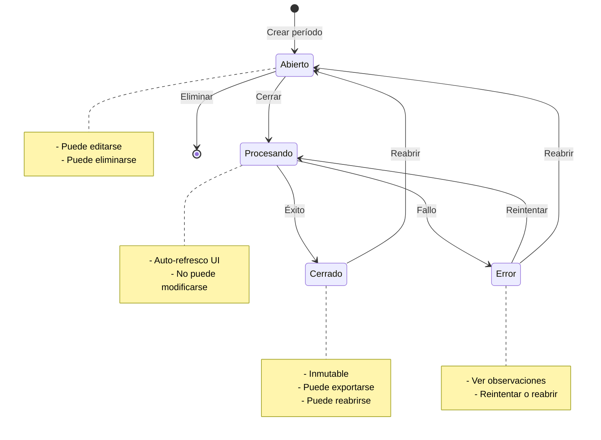
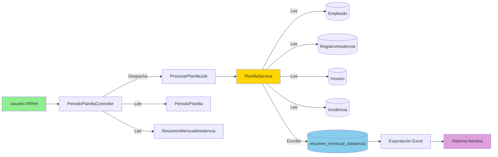
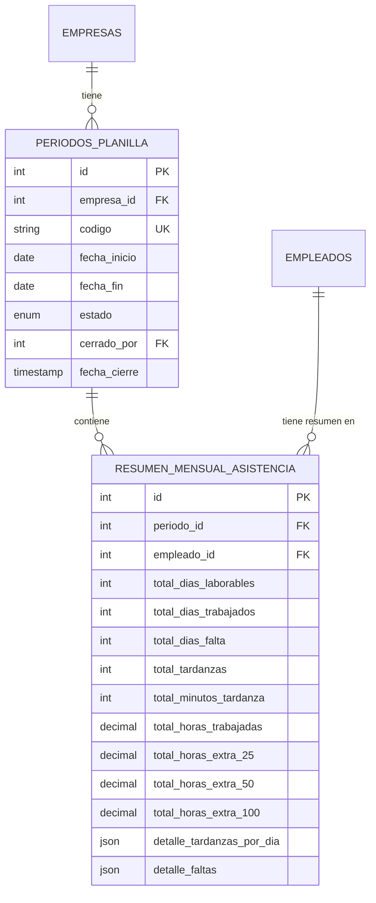
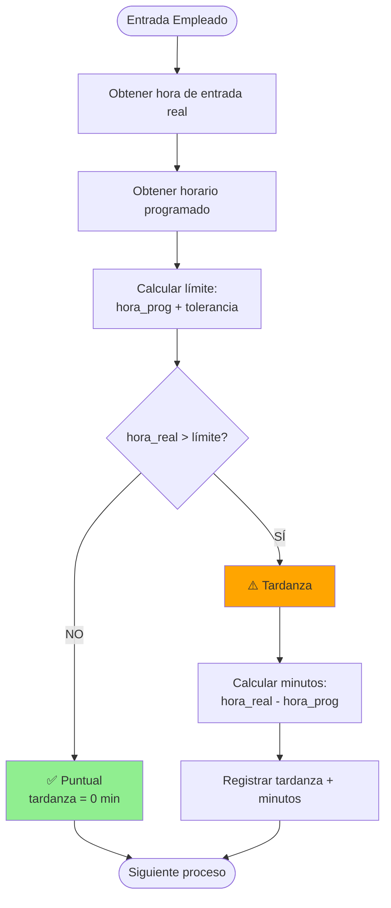
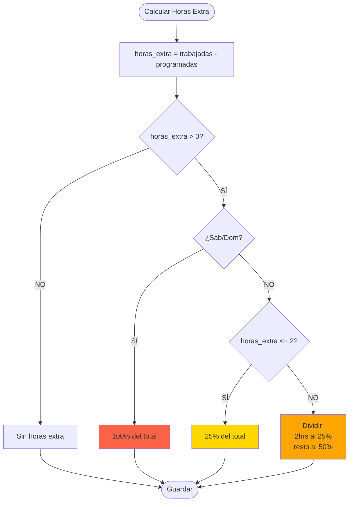

# 📊 Diagrama de Flujo - Módulo de Planillas

## Flujo de Procesamiento Completo



## Estados del Período



## Arquitectura del Sistema



## Relaciones de Base de Datos



## Cálculo de Tardanzas (Lógica)



## Clasificación de Horas Extra



## Timeline de un Período Completo

```
Día 1              Día 15             Día 30             Día 31
│                  │                  │                  │
▼                  ▼                  ▼                  ▼
┌─────────────────────────────────────────────────────────┐
│ Período: Diciembre 2025                                 │
│ Estado: ABIERTO                                         │
└─────────────────────────────────────────────────────────┘
│                                                         │
│  [Empleados marcando asistencia diariamente]           │
│                                                         │
                                                          ▼
                                              ┌───────────────────┐
                                              │ Click: Cerrar     │
                                              │ Estado: PROCESANDO│
                                              └───────────────────┘
                                                          │
                                          [Job procesando... 2-5 min]
                                                          │
                                                          ▼
                                              ┌───────────────────┐
                                              │ Estado: CERRADO   │
                                              │ Resúmenes listos  │
                                              └───────────────────┘
                                                          │
                                                          ▼
                                              ┌───────────────────┐
                                              │ Exportar Excel    │
                                              │ → Sistema Nómina  │
                                              └───────────────────┘
```

---

## Leyenda de Colores

- 🟢 **Verde**: Inicio/Fin exitoso
- 🟡 **Amarillo**: En proceso/Advertencia
- 🔵 **Azul**: Estado normal
- 🟠 **Naranja**: Atención requerida
- 🔴 **Rojo**: Error/Problema

---

**Ver más:** [Documentación completa](documentacion/Desarrollador/Módulos/03_modulo_procesamiento_planillas.md)
