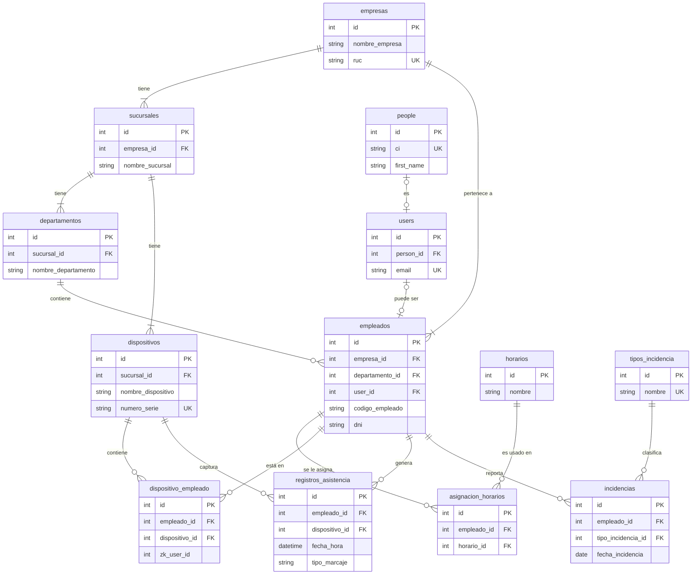

# 4. Esquema de la Base de Datos

El corazón de GobeBio reside en su estructura de base de datos relacional. Entender cómo se conectan las tablas principales es clave para desarrollar nuevas funcionalidades o depurar problemas.

## 4.1. Diagrama de Entidad-Relación (Mermaid)

El siguiente diagrama muestra las relaciones entre las tablas más importantes del sistema.

## 4.2. Descripción de Tablas Clave

### Estructura de Autenticación y Personas
*   **`people`**: Contiene información personal detallada (nombre, CI, fecha de nacimiento, etc.) de cualquier individuo en el sistema. Su objetivo es separar los datos de la "persona" de sus roles o accesos.
*   **`users`**: Almacena las credenciales (email, password) y el estado de los usuarios que pueden iniciar sesión en la plataforma. Se vincula a la tabla `people` para obtener los datos personales.
*   **`password_resets`**: Tabla estándar de Laravel para gestionar los tokens de restablecimiento de contraseña.

### Estructura Organizacional
*   **`empresas`**: Tabla principal que almacena la información de cada empresa cliente que utiliza el sistema.
*   **`sucursales`**: Almacena las diferentes sucursales o sedes asociadas a una `empresa`, permitiendo una gestión multi-sede.
*   **`departamentos`**: Contiene los departamentos dentro de cada `sucursal`, completando la jerarquía organizacional.
*   **`empleados`**: El núcleo de la gestión de personal. Almacena toda la información laboral de un empleado, incluyendo su código, contrato, y a qué `empresa` y `departamento` pertenece.

### Gestión de Horarios
*   **`horarios`**: Funciona como una plantilla para los diferentes turnos de trabajo. Define nombre, horas de entrada/salida, tolerancia y los días laborables en un campo JSON.
*   **`asignacion_horarios`**: Tabla pivote que vincula a un `empleado` con un `horario` para un rango de fechas específico (`fecha_inicio` y `fecha_fin`). Permite que un empleado cambie de turno a lo largo del tiempo.

### Gestión Biométrica y Dispositivos
*   **`dispositivos`**: Contiene los detalles de cada reloj biométrico (ej. ZKTeco), incluyendo su IP, número de serie y a qué `sucursal` pertenece. Es fundamental para la comunicación del microservicio externo.
*   **`dispositivo_empleado`**: Tabla crucial para la sincronización. Mapea un `empleado` del sistema con un `dispositivo` físico. Almacena el `zk_user_id`, que es el ID interno que el reloj le asigna a ese usuario, siendo la clave para asociar una marcación con un empleado.
*   **`huellas`**: Almacena los templates biométricos de las huellas dactilares (`template_huella`) de cada empleado, listos para ser sincronizados con los dispositivos.
*   **`rostros`**: Almacena los templates biométricos de reconocimiento facial (`template_rostro`) de cada empleado.

### Asistencia e Incidencias
*   **`registros_asistencia`**: Almacena cada marcación individual (`entrada`, `salida`, etc.) descargada desde los dispositivos o registrada por otros medios (app móvil). Es la fuente primaria para todos los cálculos y reportes.
*   **`tipos_incidencia`**: Catálogo de los posibles motivos para una incidencia (ej. "Permiso Médico", "Comisión de Servicio", "Falta justificada").
*   **`incidencias`**: Registra las solicitudes de los empleados para justificar ausencias, atrasos u otros eventos, incluyendo su estado (pendiente, aprobado, rechazado) y la evidencia asociada.

### Reportes y Logs
*   **`reportes_asistencia`**: Gestiona la generación de reportes de asistencia. Almacena la configuración (fechas, filtros) y el estado del reporte (procesando, completado), así como la ruta al archivo generado.
*   **`logs_sistema`**: Tabla de auditoría que registra acciones importantes en el sistema, como la creación o modificación de registros, guardando el "antes" y el "después" para un seguimiento detallado.

### Tablas del Sistema (Laravel y Otros)
*   **`jobs`**: Tabla estándar de Laravel para gestionar la cola de trabajos (jobs) que se ejecutan en segundo plano, como la generación de reportes.
*   **`attendance_records`**: Parece ser una tabla de recepción de datos crudos directamente desde el microservicio de Python, funcionando como un paso intermedio antes de procesar y mover los datos a `registros_asistencia`.
